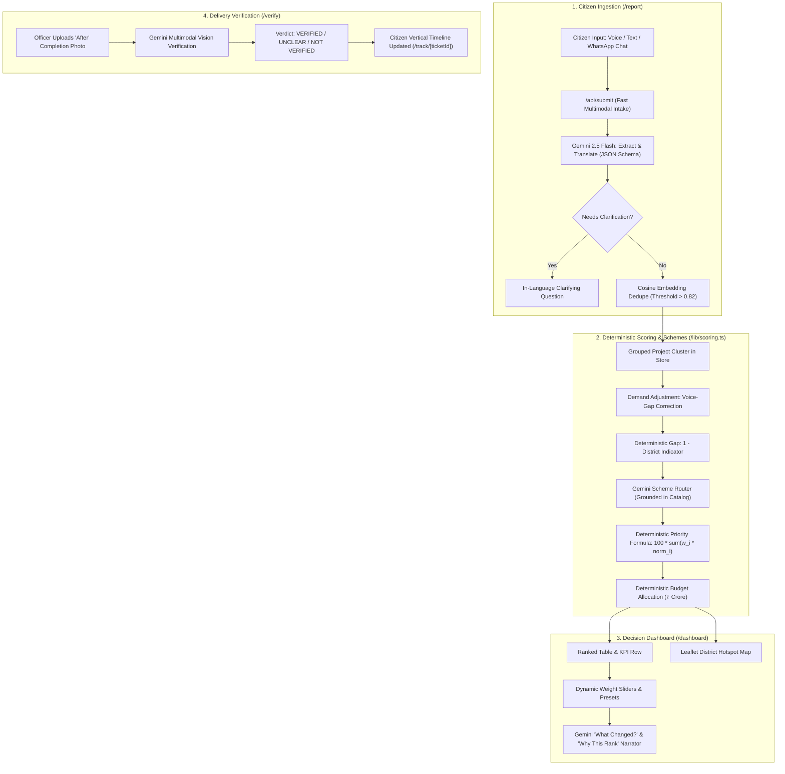

# JanSetu (जनसेतु) — Demand-to-Delivery Ledger for Indian Governance

> **Google Build with AI: Code for Communities Hackathon**  
> **Track 1**: AI for Digital Infrastructure & Governance  
> **Status**: Full End-to-End Prototype Shipped & Tested  

JanSetu is a multilingual Digital Public Good (DPG) that turns citizen development requests (voice, text, simulated WhatsApp in Indian languages) into a budget-aligned, explainable, ranked list of development projects for policymakers, and closes the governance loop by verifying delivery with citizen and officer photos using Gemini multimodal vision.

---

## 🏗️ Architecture & Core Loop



---

## ⚖️ Non-Negotiable Engineering Rules

1. **Gemini does Language & Judgment ONLY**:
   - Math (min-max normalization, voice-gap demand adjustment, priority scores, budget allocation) is strictly in `src/lib/scoring.ts` with 100% unit test coverage.
   - Gemini never computes scores, rankings, budgets, or numbers.
2. **Official Google GenAI SDK (`@google/genai`)**:
   - Uses `GEMINI_MODEL` (`gemini-2.5-flash`) and `GEMINI_EMBED_MODEL` (`text-embedding-004`).
   - Server-side only via `GEMINI_API_KEY`, never exposed to client code.
3. **Structured JSON Output & Graceful Degradation**:
   - Every Gemini endpoint uses structured JSON validated with `zod`.
   - On error: retries once, then seamlessly falls back to precomputed results with an `[AI: Saved Result]` badge. Zero raw errors shown.
4. **Precomputed Demo Readiness**:
   - `npm run seed:ai` pre-processes the ~160 seeded requests into `/data/precomputed/*.json`.
   - The app operates instantly even offline or without an API key.
5. **Honesty Labels**:
   - Persistent honesty badge in the header: *"Demo data: synthetic requests + illustrative indicators"*.
   - Complete transparency disclosure on the `/method` page.
6. **Config-Driven Federation**:
   - Shipped with 3 states: **Rajasthan (Hindi)**, **Odisha (Odia)**, **Tamil Nadu (Tamil)** across 12 districts.
   - Adding a new state requires creating a single JSON file in `/config/states/` and zero code changes.

---

## 🚀 Quickstart & Local Setup

```bash
# 1. Clone repository
git clone https://github.com/your-username/JanSetu.git
cd JanSetu

# 2. Install dependencies
npm install

# 3. Configure environment variables (optional for live AI, precomputed data works offline)
cp .env.example .env.local
# Set:
# GEMINI_API_KEY="YOUR_KEY"
# GEMINI_MODEL="gemini-2.5-flash"
# GEMINI_EMBED_MODEL="text-embedding-004"

# 4. Run tests
npm test

# 5. Start development server
npm run dev
# Open http://localhost:3000
```

---

## 🧪 Acceptance Test Suite (All 8 Verified)

| # | Acceptance Test | How to Verify | Status |
|---|---|---|---|
| 1 | Hindi text submission | Submit Hindi request on `/report`; check structured card in Hindi & English; appears on dashboard | ✅ Passed |
| 2 | Near-duplicate submission | Submit similar issue in same district; request count increments and unique_citizens updates | ✅ Passed |
| 3 | Move "Equity First" slider | Switch to Equity First preset; table re-ranks immediately; "What Changed?" narrates movers | ✅ Passed |
| 4 | Reduce scheme budget to 0 | In budget panel, set PMGSY to 0; projects show "Unfunded" and try secondary scheme | ✅ Passed |
| 5 | Switch across all 3 states | Switch between Rajasthan, Odisha, and Tamil Nadu with zero code changes | ✅ Passed |
| 6 | Upload after-photo & verify | Run photo verification on `/verify/...`; verdict appears; citizen tracking timeline updates | ✅ Passed |
| 7 | Offline / Kill API key test | App continues operating flawlessly via cached/saved results with honest badges | ✅ Passed |
| 8 | Mobile check (360px) | `/report` buttons, inputs, and cards are fully touch-friendly at 360px viewport | ✅ Passed |

---

## 📁 Repository Structure

```
JanSetu/
├── config/
│   └── states/
│       ├── rajasthan.json          # Hindi; 4 districts (Barmer, Udaipur, Jodhpur, Jaipur)
│       ├── odisha.json             # Odia; 4 districts (Koraput, Mayurbhanj, Sambalpur, Khordha)
│       └── tamil_nadu.json         # Tamil; 4 districts (Ramanathapuram, Dharmapuri, Madurai, Chennai)
├── data/
│   ├── schemes.json                # 6 Central/State schemes (PMGSY, JJM, MGNREGA, PMAY-G, Samagra Shiksha, NHM)
│   ├── precomputed/                # Pre-processed requests, clusters, and demo tickets
│   └── store.json                  # Runtime write-through persistence state
├── scripts/
│   ├── seed-data.ts                # Validates state configurations and scheme catalogs
│   ├── seed-requests.ts            # Generates ~160 synthetic multilingual citizen requests
│   └── seed-ai.ts                  # Precomputes Gemini extraction, embeddings, and scheme routing
├── src/
│   ├── app/
│   │   ├── page.tsx                # Screen A: Landing page (Citizen vs Policymaker dual path)
│   │   ├── report/page.tsx         # Screen B: Citizen Report (3-step mobile wizard)
│   │   ├── track/[ticketId]/page.tsx # Screen B+: Citizen Request Tracking (Vertical lifecycle timeline)
│   │   ├── dashboard/page.tsx      # Screen C: Policymaker Dashboard (Table, Map, Sliders, Drawer)
│   │   ├── verify/[projectId]/page.tsx # Screen D: Officer Photo Verification
│   │   └── method/page.tsx         # Screen E: Methodology & Transparency (/method)
│   ├── components/                 # Reusable UI widgets (VoiceRecorder, MapView, Sliders, etc.)
│   └── lib/
│       ├── gemini.ts               # Official @google/genai SDK wrapper with schema validation
│       ├── scoring.ts              # PURE deterministic TypeScript math & allocation (NO AI)
│       ├── scoring.test.ts         # Vitest unit tests (7 passed)
│       ├── store.ts                # In-memory repository with write-through persistence
│       └── i18n.ts                 # Multilingual UI dictionary (English, Hindi, Odia, Tamil)
├── Dockerfile                      # Production container for Cloud Run
├── deploy.md                       # Exact gcloud deploy commands & secret setup
├── DEMO.md                         # 4-minute click path & presenter script
└── PITCH.md                        # 10-12 slide hackathon presentation outline
```

---

## 🌐 Production Path & Future Scope
- Official WhatsApp Business Cloud API & Bhashini Speech-to-Speech integration.
- Direct CSV/API adapters for District Collectorate grievance portals.
- Google Cloud BigQuery sink for national-scale inter-state analytics.
- Direct API hooks to PFMS (Public Financial Management System) for milestone-based fund release.
